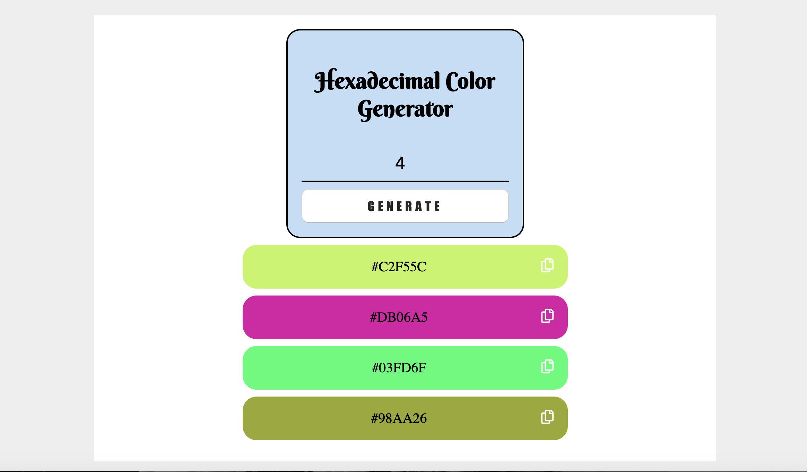

# Hexadecimal Color Generator

> This is the second mini project of javascript tutorial in Integrify!

##Demo

[color generator App]()

## Screenshot

## Technologies

- HTML
- CSS
- JavaScript

## Status

Project is: finished_,

## Contact

Created by [mostafa](https://github.mostafaIn.com) 

